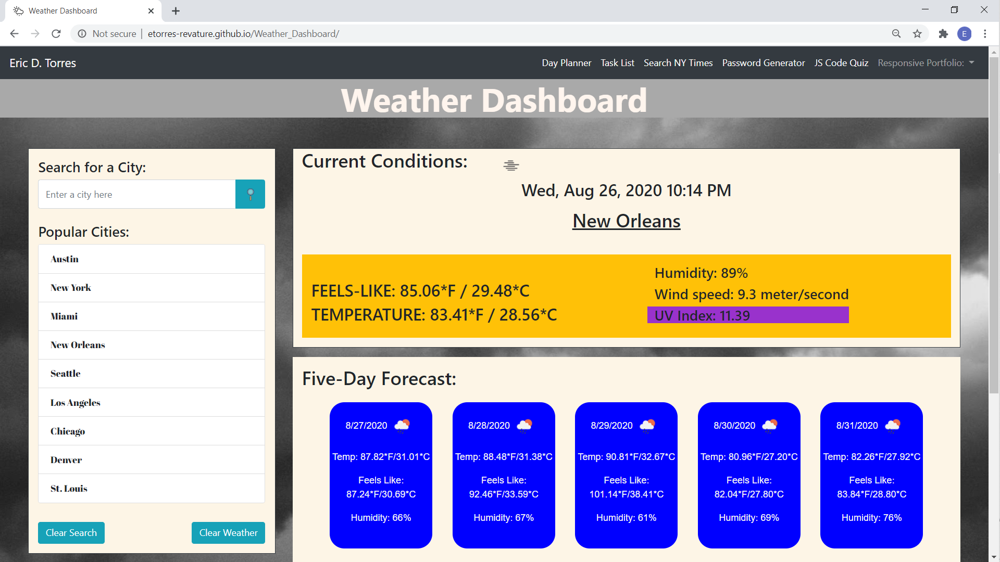
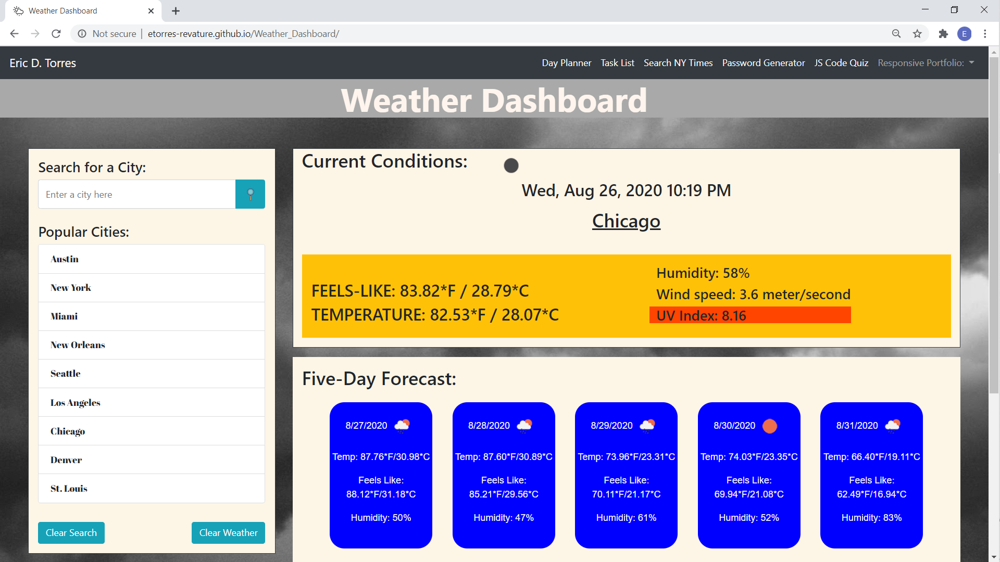
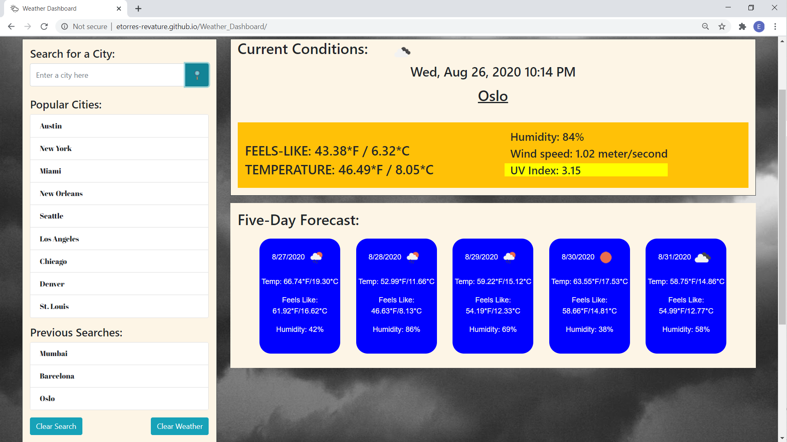
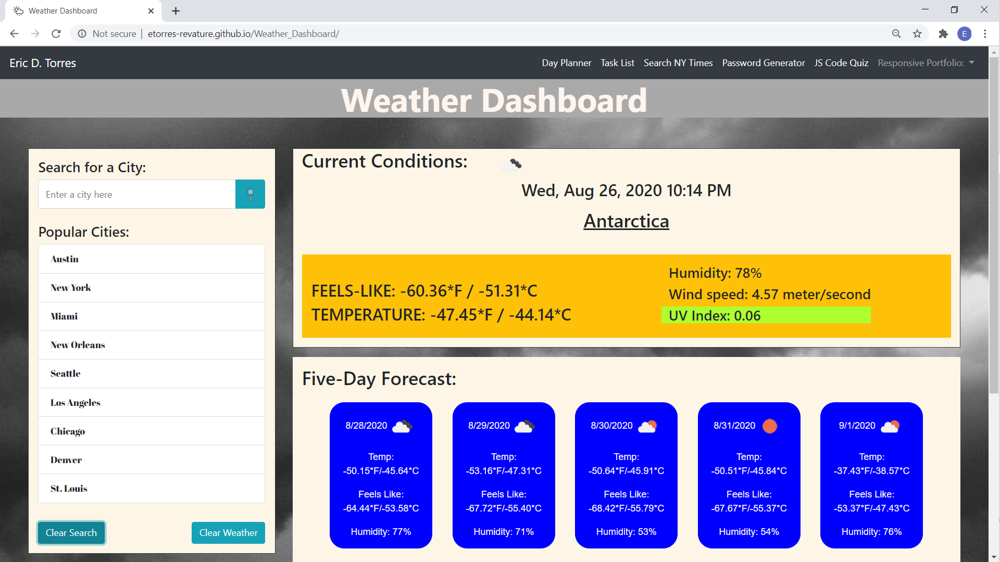
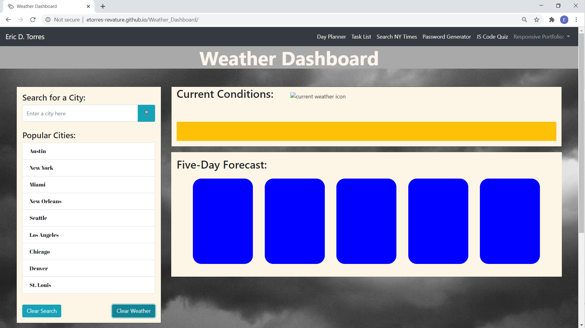

# [Weather_Dashboard](https://etorres-revature.github.io/Weather_Dashboard/)

> I have seen many storms in my life. Most
> storms have caught me by surprise, so I 
> had to learn very quickly to look further and 
> understand that I am not capable of 
> controlling the weather, to exercise the art
> of patience and to respect the fury of nature.
>          - Paulo Coelho

While humans may not be able to control the weather, modern meterology has advanced weather forecasting to a point where "surprises" can be effectively eliminated.  Doppler radar, satellites, and other modern technology give a fairly accurate depiction of what the weather will be like.  This [Weather Dashboard](https://etorres-revature.github.io/Weather_Dashboard/) uses APIs to help bring you the accurate weather for any location in the world.  

## Application Programming Interface 

An applicaiton programming interface (API) is a computing interface that defines interactions between multiple software intermediaries.  It defines the kinds of calls or requests that can be made, how to make them, the data formats that should be used, the convetnions to follow, and the schema that the data follows.  It can also provide extension mechanisms so that users can extend existing functionality in various ways to varying degrees.<a href="#footnote1">[1]</a>

### [OpenCage](https://opencagedata.com/)

The team at [OpenCage](https://opencagedata.com/) has built a geocoding API that can do both forward and reverse geocoding.  Foward geocoding is the process of finding latitude and longitude coordinates from the name of a location.  Reverse geocoding is finding a location based on the known latitude and longitude cooredinates.  The [Weather Dashboard](https://etorres-revature.github.io/Weather_Dashboard/) app uses the [OpenCage](https://opencagedata.com/) API to take in a city name as a search parameter and forward geocode the locaiton name into a set of latitude and longitude coordinates. 

### [OpenWeather](https://openweathermap.org/)

Similarly, [OpenWeather](https://openweathermap.org/) has develped an API tha will give you weather information for a location.  This information can be minutely, hourly, or daily.  It may be the current weather or a five day forecast.  In order to use the "one call" OpenWeather API latitude and longitude coordinates are needed.  The [Weather Dashboard](https://etorres-revature.github.io/Weather_Dashboard/) takes the latitude and longitude coordinates from [OpenCage](https://opencagedata.com/) and uses them in the [OpenWeather](https://openweathermap.org/) API to get current and five-day weather conditions.

> Climate is what we expect, 
> weather is what we get.
>          - Mark Twain

## How the Weather DashBoard works

The [Weather Dashboard](https://etorres-revature.github.io/Weather_Dashboard/) has a static list of "Popular Cities" for which users may want to know the weather conditions. 

Additionally, users of the [Weather Dashboard](https://etorres-revature.github.io/Weather_Dashboard/) can search for a city for which he/she wants to know the weather conditions.  When the user enters the name of the city, the app takes the entered city name and gets the latitude and longitude coordinates from OpenCage.  Once OpenCage has returned the latitutde and longitude coordinates, they are used to get the weather conditions from OpenWeather.  The information from OpenWeather is then displayed in the appropriate spaces in the dashboard.  

[Weather Dashboard](https://etorres-revature.github.io/Weather_Dashboard/) keeps track of cities that have been searched.  The searched cities are added to the "Previous Searches" list under the "Popular Cities".  Accordingly, each of the cities in the "Previous Searches" list is added to an object in local storage so that the list is persistent. 

> Weather forecast for tonight: dark.
>          - George Carlin

When a city is searched, the UV Index information is displayed.  The background of the UV Index is updated according to this range.<a href="#footnote2">[2]</a>

* **Low UV** from 0 to 2 is represnted by greenyellow 

* **Moderate UV** from 3 to 5 is represented by yellow 

* **High UV** from 6 to 7 is represented by dark orange 

* **Very High UV** from 8 to 10 is represented by orange red 

* **Extreme UV** over 11 is represented by dark orchid 

The [Weather Dashboard](https://etorres-revature.github.io/Weather_Dashboard/) also includes functionality to clear the "Previous Seaarch" ...

... and functionality to clear the currently displayed weather.

### :computer: Technologies Used :computer:

#### :memo: HTML5 :memo:

**HTML5** is a markup language used for structuring and presenting content on the World Wide Web.  The goals are to improve the language with support for the latest multi-media and other new features; to keep the language both easily readable by humans and consistently understood by computers and devices; and to remain backward compatible to older software.  Many new symantic features are included.

*HTML5* content borrowed from <a target="_blank" rel="noopener noreferrer">[this page](https://en.wikipedia.org/wiki/HTML5).</a>

#### :art: CSS :art:

**Cascading Style Sheets (CSS)** is a stylesheet language used for describing the presentation of a document written in a markup language (such as HTML5).  CSS is designed to enable the separation of presentation and content; including layout, colors, and fonts.  This separation improves content accessibility to provide more flexibility and control in the specification of presentation characteristics, enabling multiple web pages to share formatting by specifying relevant CSS in a separate file, which reduces complexity and repetition in the structural content (HTML), as well as enabling the file to be cached to improve the page load speed between the pages that share the file and its formatting.

Separation of formating and content also makes it feasible to present the same markup page in different styles for different rendering methods, such as on-screen, in print, by voice, and on Braille-based tactile devices. 

*CSS* content borrowed from <a target="_blank" rel="noopener noreferrer">[this page](https://en.wikipedia.org/wiki/Cascading_Style_Sheets).</a>

#### :shoe: Bootstrap 4 :shoe:

**Bootstrtap 4** is a free and open-source CSS framework directed at responsive, mobile-first front-end web development.  It contains CSS and (optionally) JavaScript-based design templates for typography, forms, buttons, navigation, and other interface components.  

*Bootstrap 4* content borrowed from <a target="_blank" rel="noopener noreferrer">[this page](https://en.wikipedia.org/wiki/Bootstrap_(front-end_framework)).</a>

#### :sparkler: JavaScript :sparkler:

**JavaScript (JS)** is one of the core technologies of the World Wide Web (along with HTML and CSS). It enables interactive web pages and is an essential part of web applications.  JS is a multi-faceted, scripting language that provides versatility through Application Programming Interfaces (APIs) and Document Object Model (DOM) manipulation, among others.

*JavaScript* content borrowed from <a target="_blank" rel="noopener noreferrer">[this page](https://en.wikipedia.org/wiki/JavaScript).</a>

#### :hourglass: Moment.js :hourglass:

**Moment.js** is a free and open source JavaScript library that removes the need to use the native Date object directly.  The library is a wrapper for the Date object making it easier to use.  Moment.js extends date capabilities with a variety of features, such as relative time, calendar time, durations, and multi-language support.  

*Moment.js* content borrowed from <a target="_blank" rel="noopener noreferrer">[this page](https://www.webfx.com/blog/web-design/javascript-dates-moment-js/).

## Author :sunglasses:

Content and design created by :green_heart: Eric D. Torres :green_heart:.  

The author can be reached at etorresnotary@gmail.com. 

###### License

MIT License

Copyright (c) 2020 EricDTorres

Permission is hereby granted, free of charge, to any person obtaining a copy
of this software and associated documentation files (the "Software"), to deal
in the Software without restriction, including without limitation the rights
to use, copy, modify, merge, publish, distribute, sublicense, and/or sell
copies of the Software, and to permit persons to whom the Software is
furnished to do so, subject to the following conditions:

The above copyright notice and this permission notice shall be included in all
copies or substantial portions of the Software.

THE SOFTWARE IS PROVIDED "AS IS", WITHOUT WARRANTY OF ANY KIND, EXPRESS OR
IMPLIED, INCLUDING BUT NOT LIMITED TO THE WARRANTIES OF MERCHANTABILITY,
FITNESS FOR A PARTICULAR PURPOSE AND NONINFRINGEMENT. IN NO EVENT SHALL THE
AUTHORS OR COPYRIGHT HOLDERS BE LIABLE FOR ANY CLAIM, DAMAGES OR OTHER
LIABILITY, WHETHER IN AN ACTION OF CONTRACT, TORT OR OTHERWISE, ARISING FROM,
OUT OF OR IN CONNECTION WITH THE SOFTWARE OR THE USE OR OTHER DEALINGS IN THE
SOFTWARE.

<a name="footnote1">[API Wikipedia page](https://en.wikipedia.org/wiki/API)</a>

<a name="footnote2">[UV Index Wikipedia page](https://en.wikipedia.org/wiki/Ultraviolet_index)</a>